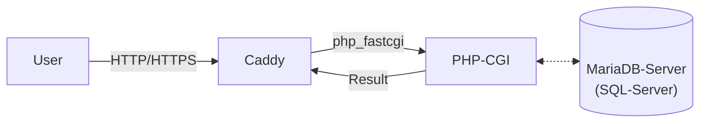

# WCMP (Windows Caddy MariaDB PHP)[^wcmp_notice]

tool for setting up a caddy-server with PHP and MariaDB support

## Warning

*WCMP is still in active developement*

Please note, that WCMP was designed for development purposes.
You could try to use it in production.

If you find any bugs or have any suggestions, please open an issue at [issues](https://github.com/Hope-IT-Works/WCMP/issues/new/choose).

## About

After some research, I realized that there was no way to set up a caddy server with PHP support without much effort. That's why I created this repository. Later MariaDB-server support was integrated too.



The script is pretty advanced and tries to do everything automatically. If it fails at any point, it will tell you what happened.

WCMP comes with default configuration files for all components. You can change them later if you want.

## How to install

1. Start PowerShell as Administrator
2. Run the following command:

```powershell
Invoke-WebReqeust -UseBasicParsing -Uri "https://raw.githubusercontent.com/Hope-IT-Works/WCMP/main/src/Invoke-WCMPSetup.ps1" | Invoke-Expression 
```

The script

- always checks for the latest versions of all components during installation.
- will suggest available PHP versions and lets you choose.

## How to run

By default, WCMP installs Windows Services which start automatically.

You can start the services manually with the following commands:

### Caddy Server

```bash
.\caddy\caddy.exe run --watch
```

### MariaDB Server

```bash
.\mariadb\bin\mysqld.exe
```

### PHP-CGI Server

```bash
.\php\php-cgi.exe -b 127.0.0.1:9000
```

## Documentation

| Service | Documentation |
| --- | --- |
| Caddy | [Link](https://caddyserver.com/docs/command-line) |
| MariaDB | [Link](https://mariadb.com/kb/en/documentation/) |
| PHP | [Link](https://www.php.net/manual/en/features.commandline.options.php) |

## FAQ

<details><summary>Is it portable?</summary>
<p>
       By default, WCMP installs Windows Services that are non-portable. Skip the service installation with ```-SkipWinSW``` , if you want an portable installation.
       The services used by WCMP are configured to work portable. Move your installation where you want.
</p>
</details>

<!--
<details><summary></summary>
<p>
       
</p>
</details>
-->

<details><summary>Why MariaDB?</summary>
<p>
       MariaDB is a open-source fork of MySQL. MariaDB provides better performance and more features than MySQL.<br>
       <a href="https://www.guru99.com/mariadb-vs-mysql.html">More Information on this topic</a>
</p>
</details>

[^wcmp_notice]: e.g. LAMP (Linux Apache MySQL PHP)
